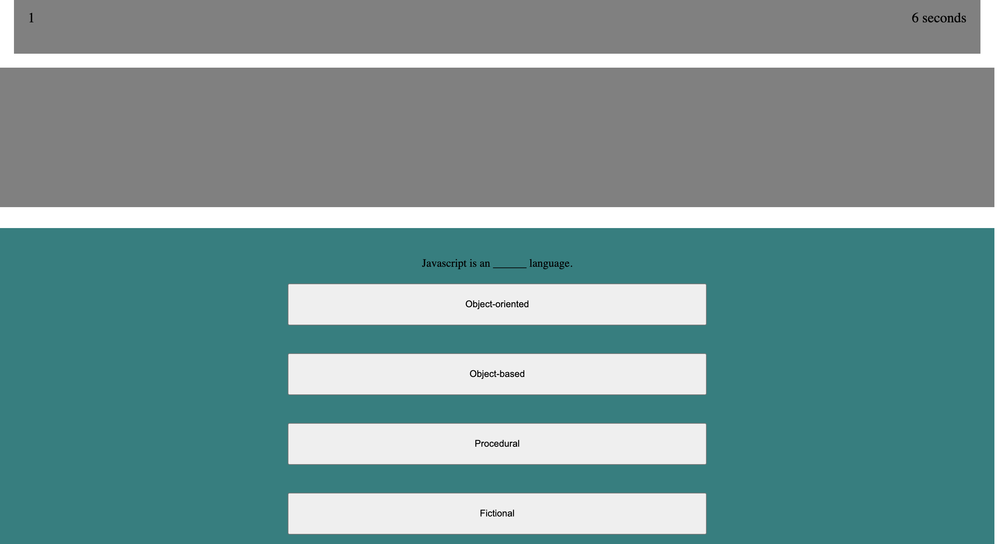

# Quiz.game

Timed quiz of Javascript fundamentals
Score and time is displayed at the top of the screen
Click the start button order in order to start the quiz
Each correct answer will increase the score and each incorrect answer will decrement the time remaining

When the time reaches 0, the quiz will end and the user will see their score and the highest score

